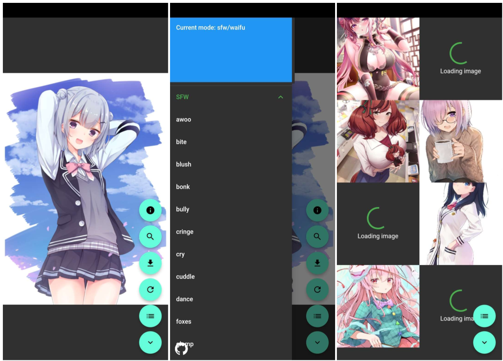

## Waifu Generator
Generate random waifu images for Android devices

### Build from source
- Initialize the project with
```
flutter create --platforms android --project-name waifu .
```
- Generate a keystore (if you haven't got one) at `android/app/upload-keystore.jks`
```
keytool -genkey -v -keystore android/app/upload-keystore.jks -storetype pkcs12 -keyalg RSA -keysize 2048 -validity 10950 -alias upload < ci/sample-keygen-input.txt
```
- Add `android/app/key.properties` as specified [here](https://docs.flutter.dev/deployment/android#reference-the-keystore-from-the-app)
- Build the project for testing with `flutter run`, or for release with `flutter build apk`. You can also find the APK for the latest version [here](https://github.com/Serious-senpai/waifu/releases/latest)

### Screenshots

